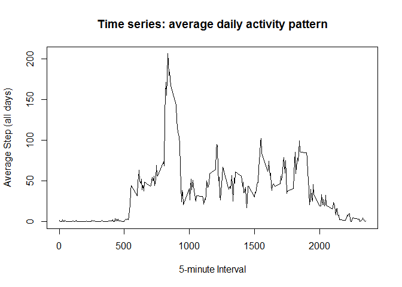
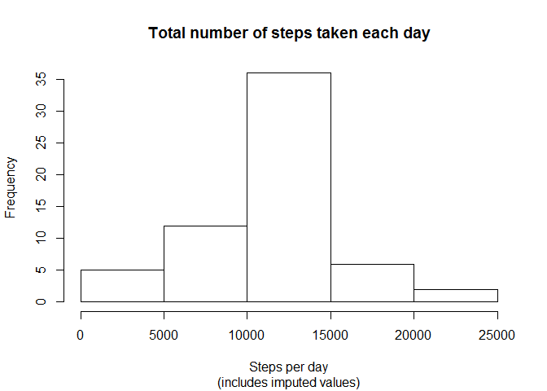
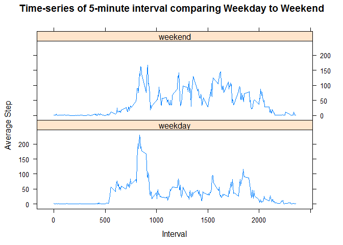

# Reproducible Research - Project 1
___

## Research Description 
(from assignment instructions)

It is now possible to collect a large amount of data about personal movement using activity monitoring devices such as a Fitbit, Nike Fuelband, or Jawbone Up. These type of devices are part of the "quantified self" movement - a group of enthusiasts who take measurements about themselves regularly to improve their health, to find patterns in their behavior, or because they are tech geeks. But these data remain under-utilized both because the raw data are hard to obtain and there is a lack of statistical methods and software for processing and interpreting the data.

This assignment makes use of data from a personal activity monitoring device. This device collects data at 5 minute intervals through out the day. The data consists of two months of data from an anonymous individual collected during the months of October and November, 2012 and include the number of steps taken in 5 minute intervals each day.

___
## Dataset Description : 

### Activity dataset

step activity monitoring data [52K]

The variables included in this dataset are:

    - steps: Number of steps taking in a 5-minute interval (missing values are coded as NA)

    - date: The date on which the measurement was taken in YYYY-MM-DD format

    - interval: Identifier for the 5-minute interval in which measurement was taken

The dataset is stored in a comma-separated-value (CSV) file and there are a total of 17,568 observations in this dataset.

___

## Data Processing and Analysis

### Read / Process Data


```r
library(lattice)  ## for xyplot

activity <- read.csv("activity.csv")

summary(activity)  
```

```
##      steps                date          interval     
##  Min.   :  0.00   2012-10-01:  288   Min.   :   0.0  
##  1st Qu.:  0.00   2012-10-02:  288   1st Qu.: 588.8  
##  Median :  0.00   2012-10-03:  288   Median :1177.5  
##  Mean   : 37.38   2012-10-04:  288   Mean   :1177.5  
##  3rd Qu.: 12.00   2012-10-05:  288   3rd Qu.:1766.2  
##  Max.   :806.00   2012-10-06:  288   Max.   :2355.0  
##  NA's   :2304     (Other)   :15840
```

### Calculate total number of steps taken per day


```r
totalSteps <- aggregate(activity$steps, list(stepDate = activity$date), FUN="sum")
# Rename a column in R
names(totalSteps)[2]<-"stepCount"
```

### Histogram:  Total number of Steps taken each day


```r
hist(totalSteps$stepCount,xlab= "Steps per day", main= "Total number of steps taken each day")
```

 

###  Calculate mean/median total steps per day


```r
meanSteps <- as.character(round(mean(totalSteps$stepCount,na.rm=TRUE),digits=2))

medianSteps <- median(totalSteps$stepCount,na.rm=TRUE)
```

*<b>Mean total number of steps taken per day:</b>
10766.19

*<b>Median total number of steps taken per day:</b>
10765

Mean and median are very close

___

### Average daily activity pattern:  calculate average steps at each interval over all days


```r
avgIntervalSteps <- aggregate(activity$steps, list(interval = activity$interval), FUN="mean", na.rm=TRUE)
# Rename a column in R
names(avgIntervalSteps)[2]<-"avgStep"
```

### Time series plot of the 5-minute interval (x-axis) and the average number of steps taken, averaged across all days (y-axis)


```r
plot(avgIntervalSteps$interval, avgIntervalSteps$avgStep, type="l", xlab= "5-minute Interval", ylab= "Average Step (all days)", main="Time series: average daily activity pattern")
```

 

###  Get max steps and associated interval


```r
maxSteps <- subset(avgIntervalSteps,avgStep==max(avgIntervalSteps$avgStep))
```

* <b>Interval 835 contains the maximum number of steps (206.1698113) on average across all days in the dataset.</b>

___

### Imputing Missing Values

Note that there are a number of days/intervals where there are missing values (coded as NA). The presence of missing days may introduce bias into some calculations or summaries of the data.


```r
##Calculate and report the total number of missing values in the dataset (i.e. the total number of rows with NAs) 
totalNA <- nrow(subset(activity,is.na(steps)))
```

* <b>Total number of missing values in Activity dataset:  
2304 </b>

___

### Create a new dataset that is equal to the original dataset but with the missing data filled in.

Impute Missing Values Using the average step for that 5-minute interval, as computed above


```r
## Merge activity and average interval
activityImpute <- merge(activity,avgIntervalSteps, by.x= "interval",by.y="interval")

## Set steps values to avgStep value when steps=NA
 activityImpute$steps[is.na(activityImpute$steps)] <- activityImpute$avgStep[is.na(activityImpute$steps)] 
summary(activityImpute)
```

```
##     interval          steps                date          avgStep       
##  Min.   :   0.0   Min.   :  0.00   2012-10-01:  288   Min.   :  0.000  
##  1st Qu.: 588.8   1st Qu.:  0.00   2012-10-02:  288   1st Qu.:  2.486  
##  Median :1177.5   Median :  0.00   2012-10-03:  288   Median : 34.113  
##  Mean   :1177.5   Mean   : 37.38   2012-10-04:  288   Mean   : 37.383  
##  3rd Qu.:1766.2   3rd Qu.: 27.00   2012-10-05:  288   3rd Qu.: 52.835  
##  Max.   :2355.0   Max.   :806.00   2012-10-06:  288   Max.   :206.170  
##                                    (Other)   :15840
```

### Calculate total number of steps taken per day (including imputed values)


```r
totalStepsImpute <- aggregate(activityImpute$steps, list(stepDate = activityImpute$date), FUN="sum")
# Rename a column in R
names(totalStepsImpute)[2]<-"stepCount"
```

### Histogram: Total number of steps taken each day (including imputed values)


```r
hist(totalStepsImpute$stepCount,xlab= "Steps per day", main= "Total number of steps taken each day",sub= "(includes imputed values)")
```

 

___

### Calculate and report the mean and median total number of steps taken per day.


```r
##  Calculate mean/median total steps per day

meanStepsImpute <- as.character(round(mean(totalStepsImpute$stepCount,na.rm=TRUE),digits=2))

medianStepsImpute <- as.character(round(median(totalStepsImpute$stepCount,na.rm=TRUE),digits=2))
```
 * <b>Mean total number of steps taken per day (including imputed values):</b>
10766.19

 * <b>Median total number of steps taken per day (including imputed values):</b>
10766.19

Imputing these values had very little impact, except to bring the median closer to the mean.  

___

### Differences in activity patterns between weekdays and weekends


```r
## Use the dataset with the filled-in missing values for this part.

## Create a new factor variable in the dataset with two levels - "weekday" and "weekend" indicating whether a given date is a weekday or weekend day.
activityImpute["weekday"] <- weekdays(as.Date(activityImpute$date))
activityImpute["weekdayType"] <- ifelse(activityImpute$weekday %in% c("Saturday","Sunday"),"weekend","weekday")

## average
avgIntervalStepsImpute <- aggregate(activityImpute$steps, list(interval = activityImpute$interval, weekdayType= activityImpute$weekdayType), FUN="mean", na.rm=TRUE)
# Rename a column in R
names(avgIntervalStepsImpute)[3]<-"avgStep"
```

### Panel plot containing a time series plot of the 5-minute interval (x-axis) and the average number of steps taken, averaged across all weekday days or weekend days (y-axis). 


```r
xyplot(avgIntervalStepsImpute$avgStep ~ avgIntervalStepsImpute$interval | avgIntervalStepsImpute$weekdayType, type="l", layout= c(1,2), xlab= "Interval", ylab= "Average Step", main= "Time-series of 5-minute interval comparing Weekday to Weekend")
```

 


Week day activity seems very similar to overall activity, with 1 big spike, but weekend activity is different, with several larger spikes in activity throughout the day.
